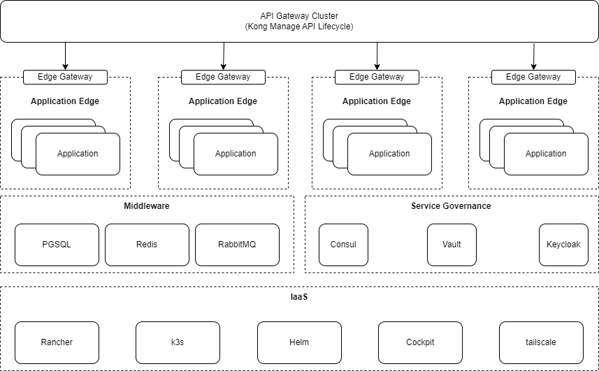

# Infrastructure Deployment Architecture

## Deployment


- Container Orchestrator : Docker Compose - > k3s
- ingress: Kong API Gateway 
- Service Registry & Configuration Center : Consul
- Database : PGSQL
- Cache : Redis
- MQ : EMQX
- Log : MongoDB

## Script Logic

Requirement
- Machine for deployment
- Deployment script executes environment


Start Priority  
1. Deploy IaaS
2. Deploy Middleware
3. Deploy service governance component
4. Deploy application service

### k3s Implementation

### Docker Compose Implementation
This implementation not need IaaS, install Docker and Docker Compose before starting.

1. Install Docker and Docker Compose
```bash
docker-compose -f application-architecture-compose.yaml up -d
```
2. Start service

```bash
docker-compose -f ./compose/middleware-compose.yaml
docker-compose -f ./compose/service-governance-compose.yaml
```
